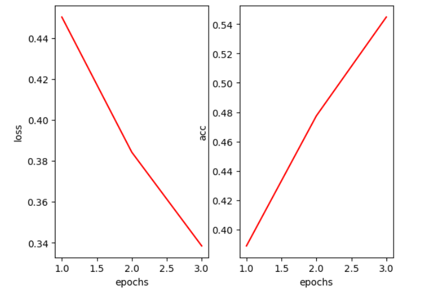
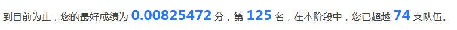
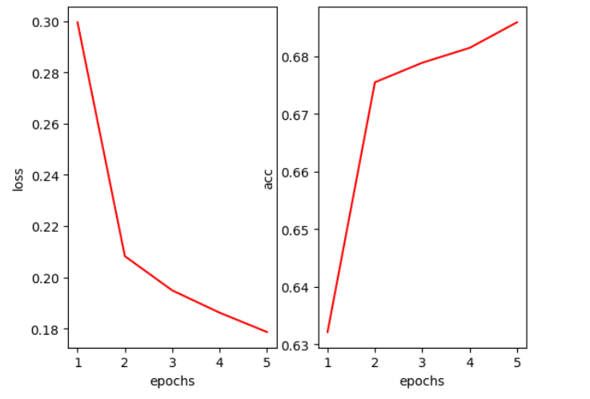
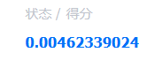
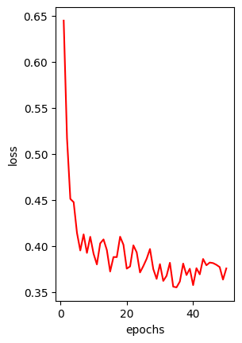
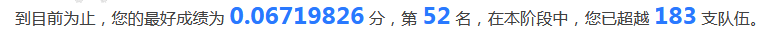

## **图书推荐系统**

### **【概述】**

基于NCF、SASRec两种方法实现[图书推荐任务](https://www.datafountain.cn/competitions/542/)。

### **【NCF】**

运行环境：[Kaggle](https://www.kaggle.com/code/xinglingchen/book-recommend)

参考代码：[官方基线](https://work.datafountain.cn/forum?id=563&type=2&source=1)

#### **1.【数据准备】**

读入训练集：

```txt
【训练集】共53424个用户，10000本图书，5869631条记录
     user_id  item_id
0		0		257
1		0		267
2		0		5555
3		0		3637
4		0		1795
```

构造负样本：每个用户随机抽取三个未交互的物品构成加入训练集。

#### **2.【模型】**

**神经协同过滤(NCF)**：

- Embedding Layer: 嵌入层，将稀疏的one-hot用户/物品向量转化为稠密的低维向量

- GMF Layer: 通过传统的矩阵分解算法，将以用户和物品的嵌入向量做内积。有效地提取浅层特征。

- MLP Layer: 通过n层全连接层，提取深层特征。

- Concatenation Layer: 将GMF和MLP输出的结果做concat，结合其中的深层和浅层信息。

- Output Layer: 输出层，输出用户-物品对的最终评分。


#### **3.【训练】**

参数：`hiddem_dim = 16`

按照 `BATCH_SIZE = 512` 划分数据集，训练 `epoch=5` 保存至 `model.h5`：$loss \approx 0.34, hits\approx 0.54$





由于训练速度较慢，改变参数 `BATCH_SIZE = 2048`

训练 `epoch=8+5`保存至 `model_8+5.h5`：$loss \approx 0.18, hits\approx 0.69$

（中间数据未记录）



但分数反而下降了，可能是因为 `BATCH_SIZE` 太大导致过拟合。



### **【SASRec】**

参考代码：[Github - SASRec.pytorch](https://github.com/pmixer/SASRec.pytorch)

#### **1.【数据处理】**

参考代码用的数据编号从1开始，调整一下：

```python
#【数据处理】
import pandas as pd
data = pd.read_csv('datasets/train.csv')
data.iloc[:,:]+=1 #将两列所有元素都+1
max_user_id=data.user_id.max()
max_item_id=data.item_id.max()
print("max_user_id:",max_user_id)
print("max_item_id:",max_item_id)
print(data,'\n')

data.to_csv("data/book.txt",index=0,header=0,sep=' ')
```

输出：

```text
max_user_id: 53424
max_item_id: 10000

         user_id  item_id
0              1      258
1              1      268
2              1     5556
3              1     3638
4              1     1796
...          ...      ...
5869626    49802     4656
5869627    49802     5092
5869628    49802     5295
...
[5869631 rows x 2 columns] 
```

#### **2.【模型】**

**自我注意力机制序列推荐(SASRec)**：

- Input: 定义一个用户的行为序列 ，用于预测下一个用户可能发生交的物品但需要依赖之前用户的交互历史。

- Embedding Layer: 添加Positional Embedding表示序列中的先后关系，再与行为序列相加。

- Self-Attention: Stacking(Self-Attention Block+Feed Forward)并通过加入残差连接、layer normalization和dropout解决过拟合、梯度消失、训练时间长的问题。

- Output Layer :通过对用户行为序列和物品Embedding矩阵作内积得出user-item相关性矩阵，之后将分数排序筛选完成推荐


#### **3.【训练】**

```python
#【默认参数】
batch_size=128
dropout_rate=0.2
eval_epochs=5
hidden_units=50
inference_only=False
l2_emb=0.0
lr=0.001
maxlen=200
num_blocks=2
num_heads=1
```

训练速度比 NCF 要快很多。

```python
#【训练】
%run main.py --dataset=book --train_dir=trainstatus --num_epochs=50 --eval_epochs=5 --device=cuda
```



#### **4.【测试】**

载入使用 `epoch=40` 时的模型参数。

```python
#【载入模型参数】
class args():
    def __init__(self):
        ...
        self.state_dict_path = './book_trainstatus/SASRec.epoch=40.lr=0.001.layer=2.head=1.hidden=50.maxlen=200.pth'
        self.device = 'cuda'
        
args=args()
#max_user_id: 53424
#max_item_id: 10000
model = SASRec(53424, 10000, args).to(args.device)
model.load_state_dict(torch.load(args.state_dict_path,map_location=torch.device(args.device)))
model.eval()
```

每个用户对所有未交互物品进行预测，选择分数最大的前十个作为预测结果。

分数大幅提升：

